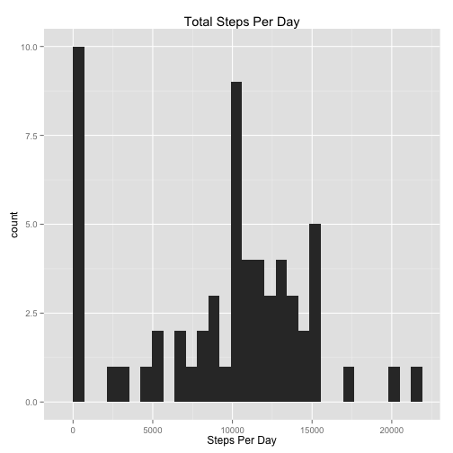
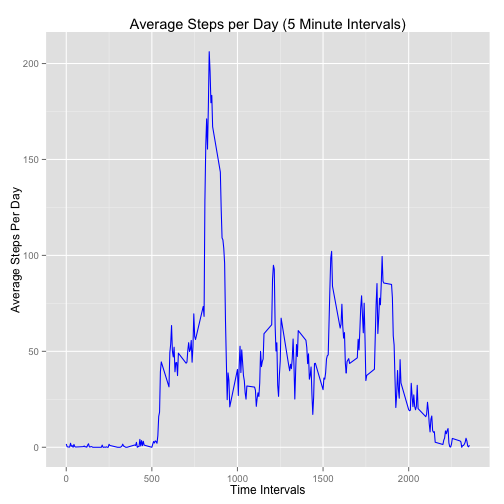
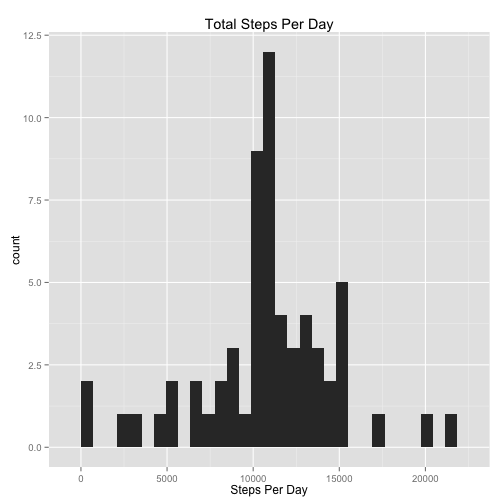
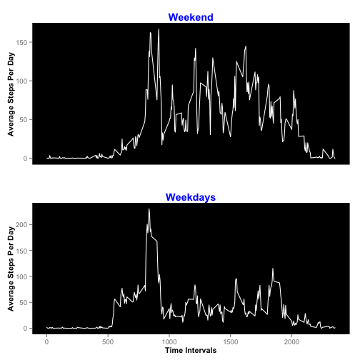

# Reproducible Research: Peer Assessment 1


## Loading and preprocessing the data

```r
unzip("./activity.zip")
data <- read.csv("./activity.csv")
library("ggplot2")
library("gridExtra")
```

```
## Loading required package: grid
```

```r
library("knitr")
```


## What is mean total number of steps taken per day?

```r
steps_per_day <- aggregate(data$step, by = list(data$date), FUN = sum, na.rm = TRUE)
names(steps_per_day)[2] <- "total steps"
ggplot(steps_per_day, aes(x = steps_per_day[, 2])) + geom_histogram() + xlab("Steps Per Day") + 
    ggtitle("Total Steps Per Day")
```

```
## stat_bin: binwidth defaulted to range/30. Use 'binwidth = x' to adjust this.
```

 

```r
mean(steps_per_day[, 2])
```

```
## [1] 9354
```

```r
median(steps_per_day[, 2])
```

```
## [1] 10395
```


## What is the average daily activity pattern?

```r
average_steps_per_int <- aggregate(data$steps, by = list(data$interval), FUN = mean, 
    na.rm = TRUE)
ggplot(average_steps_per_int, aes(x = average_steps_per_int[, 1], y = average_steps_per_int[, 
    2])) + geom_line(color = "blue") + xlab("Time Intervals") + ylab("Average Steps Per Day") + 
    ggtitle("Average Steps per Day (5 Minute Intervals)")
```

 

```r
max_steps <- max(average_steps_per_int[, 2])
## Time Interval with Highest Average Number of Steps
average_steps_per_int[average_steps_per_int[, 2] == max_steps, 1]
```

```
## [1] 835
```


## Imputing missing values
##Total Rows with NA Values in Each Value

```r
sum(is.na(data$date))
```

```
## [1] 0
```

```r
sum(is.na(data$interval))
```

```
## [1] 0
```

```r
sum(is.na(data$steps))
```

```
## [1] 2304
```

```r

## The NA values in 'steps' are replaced with the average value for that time
## interval.

for (i in 1:nrow(data)) {
    if (is.na(data[i, 1]) == TRUE) {
        Group.1 <- data[i, 3]
        place <- average_steps_per_int[average_steps_per_int[, 1] == Group.1, 
            2]
        data[i, 1] <- place
        
    }
}

steps_per_day <- aggregate(data$step, by = list(data$date), FUN = sum)
names(steps_per_day)[2] <- "total steps"
ggplot(steps_per_day, aes(x = steps_per_day[, 2])) + geom_histogram() + xlab("Steps Per Day") + 
    ggtitle("Total Steps Per Day")
```

```
## stat_bin: binwidth defaulted to range/30. Use 'binwidth = x' to adjust this.
```

 

```r
mean(steps_per_day[, 2])
```

```
## [1] 10766
```

```r
median(steps_per_day[, 2])
```

```
## [1] 10766
```


## Are there differences in activity patterns between weekdays and weekends?

```r
data$date <- as.Date(data$date)
days <- weekdays(data$date)
data <- cbind(data, days)

for (i in 1:nrow(data)) {
    if (data[i, 4] == "Saturday" || data[i, 4] == "Sunday") {
        data[i, 5] <- "weekend"
    } else (data[i, 5] <- "weekday")
}

names(data)[5] <- "day_type"
data$day_type <- as.factor(data$day_type)
data_split <- split(data, data$day_type)
weekdays <- data_split[[1]]
weekends <- data_split[[2]]

average_steps_per_int_d <- aggregate(weekdays$steps, by = list(weekdays$interval), 
    FUN = mean, na.rm = TRUE)

plot_weekdays <- ggplot(average_steps_per_int_d, aes(x = average_steps_per_int_d[, 
    1], y = average_steps_per_int_d[, 2])) + geom_line(color = "white") + xlab("Time Intervals") + 
    ylab("Average Steps Per Day") + ggtitle("Weekdays") + theme(plot.title = element_text(color = "blue", 
    face = "bold"), panel.background = element_rect(fill = "black"), axis.title = element_text(size = rel(0.9), 
    face = "bold"), panel.grid.major = element_blank(), panel.grid.minor = element_blank())

average_steps_per_int_e <- aggregate(weekends$steps, by = list(weekends$interval), 
    FUN = mean, na.rm = TRUE)

plot_weekend <- ggplot(average_steps_per_int_e, aes(x = average_steps_per_int_e[, 
    1], y = average_steps_per_int_e[, 2])) + geom_line(color = "white") + xlab("Time Intervals") + 
    ylab("Average Steps Per Day") + ggtitle("Weekend") + theme(plot.title = element_text(color = "blue", 
    face = "bold"), panel.background = element_rect(fill = "black"), axis.title = element_text(size = rel(0.9), 
    face = "bold"), panel.grid.major = element_blank(), panel.grid.minor = element_blank())

plot_weekend <- plot_weekend + theme(axis.text.x = element_blank(), axis.title.x = element_blank(), 
    axis.ticks.x = element_blank())

grid.arrange(plot_weekend, plot_weekdays)
```

 

